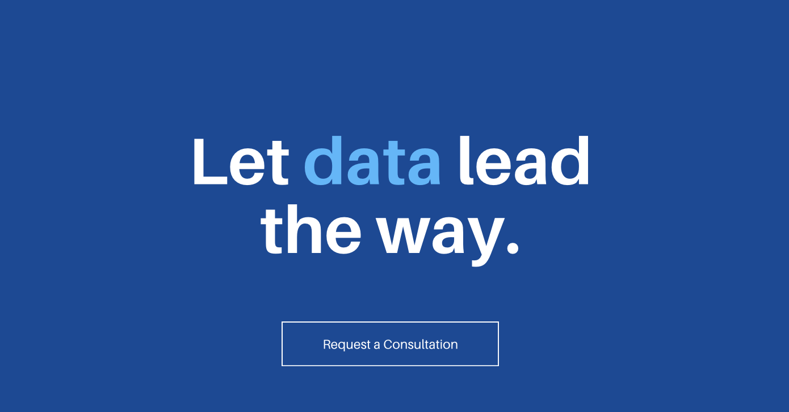

  

<h1 align="center">Welcome to Klyrovianalytics 👋</h1>

  Turning data into decisions — with clarity, precision, and impact.

---

## 🚀 About Us

**Klyrovianalytics** is a data science and AI consulting firm helping businesses unlock value through intelligent analytics. We specialize in building end-to-end solutions across industries using:

- 🔹 Machine Learning & Predictive Modeling  
- 🔹 Business Intelligence & Dashboards  
- 🔹 NLP & Text Analytics  
- 🔹 Automation & Data Pipelines  

Whether it’s healthcare, finance, retail, or beyond — we craft scalable, data-driven solutions tailored to your needs.

---

## 🛠️ Services

- ✅ Data Science Consulting  
- ✅ Machine Learning Systems  
- ✅ Power BI & Streamlit Dashboards  
- ✅ Natural Language Processing  
- ✅ Data Engineering & ETL  
- ✅ AI-Powered Automation  

---

## 📈 Featured Projects

Stay tuned for open-source tools, case studies, and smart data apps — all built to empower modern businesses with insights that matter.

---

## 🤝 Connect With Us

Let’s collaborate or talk data:
- 🔗 [LinkedIn](https://www.linkedin.com/in/klyrovia-analytics)
- 📫 Reach out via issues or project discussions here on GitHub

---

  <i>“Smarter analytics. Better outcomes.”</i>

